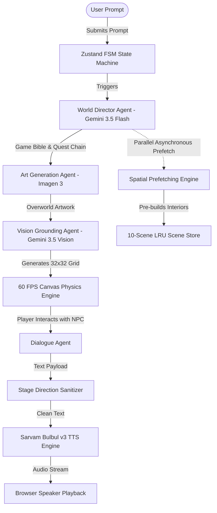

# OriginalGame — Real-Time Generative World Engine

> **Prompt a single sentence. Step inside a fully playable 2D universe instantly.**

**OriginalGame** is a zero-asset, real-time generative game engine that transforms short natural language prompts into fully interactive, voiced 2D adventure environments directly inside your browser. 

Imagine typing:
> *"A sun-scorched 1893 Champaner village during the drought, where I must deliver a hidden wager scroll to Bhuvan before the British captain arrives."*

Within moments, **OriginalGame** synthesizes and loads a complete 2D RPG realm: an isometric backdrop rendered by Gemini image models, a canvas-driven player avatar responsive to WASD/Touch movement, physical obstacles mapped to a 32x32 walkability mask, exploreable interior buildings, regional NPCs who converse using Sarvam Bulbul v3 voice streams, and an unraveling mystery leading to a grand finale reveal.

---

## Why Multimodal AI is Fundamental to OriginalGame

OriginalGame is not a static text-to-image generator or a branching narrative UI. Live multimodal AI generation is the backbone of the entire gameplay loop:

1. **Fully Dynamic Runtime Generation**: Nothing in OriginalGame is pre-built. Overworld environments, interior rooms, NPC personalities, collision boundaries, and victory frames are created strictly on-the-fly at runtime.
2. **Background Spatial Prefetching**: As soon as the main overworld spawns, an autonomous Vision Agent generates all interior locations simultaneously while you walk. By pre-building rooms ahead of player movement, stepping through doorways requires zero load time.
3. **Orchestrated Agent Telemetry**: A single 5-minute session triggers over **20+ automated AI operations** — balancing narrative planning, image synthesis, visual spatial perception, code-switched dialogue generation, and regional TTS speech. The live in-game HUD displays active agent states, model calls, and session execution costs in real time (running at paise-scale efficiency under ₹0.60).

---

## Cultural & Creative Impact in India

**OriginalGame** brings Indian history, regional cinema, and local folklore to life without requiring massive production budgets:

* **Folklore & Storytelling Preservation**: Recreate legendary period settings — from Champaner in *Lagaan* to historic trade routes — voiced natively across regional Indian languages and accents (Hindi, Marathi, Tamil, Kannada, and Indian English).
* **Interactive Educational Worlds**: Teachers and students can input any historical era and immediately walk through a grounded 2D space to interact with voiced historical figures.
* **Democratized Game Authoring**: Shifts the cost of indie game environment design from expensive studio budgets to accessible paise-per-play runtime costs.

---

## Engine Architecture Overview

* **Rendering Engine**: Next.js 16 (App Router), React, HTML5 60 FPS Canvas Physics Engine, Tailwind CSS.
* **State Management**: Zustand Finite State Machine (`IDLE`, `CREATING_WORLD`, `EXPLORING`, `DIALOGUE_ACTIVE`, `PREFETCHING`, `FINALE_UNRAVELED`) with 10-scene LRU memory caching.
* **AI Pipeline**: Google Gemini 3.5 Flash (Narrative Director & Dialogue), Gemini 2.5 Flash Image / Imagen 3 (Environment Art), Gemini 3.5 Vision (32x32 Spatial Walkability Grids).
* **Voice Synthesis**: Sarvam Bulbul v3 Regional TTS with SHA-256 `IndexedDB` audio caching and browser `SpeechSynthesis` graceful fallback.
* **Cloud Infrastructure**: Supabase Auth and 6-Character World Sharing System.

anding Page & Red Wax Seal RPG UI**
  - High-aesthetic parchment menu with red wax seal badges (`📜`), preset world cards, and mouse-tracking parallax background silhouettes.
- [x] **Image 2 Style 45° Diamond NPC Avatar Frames**
  - Painterly character portraits set inside golden 45°-rotated diamond frames.
- [x] **Defeat & Victory Branching Modals (`DEFEAT_CAPTURED` & `FINALE_UNRAVELED`)**
  - Dynamic game state machine handling game-over captures, one-click retries, and dramatic finale mystery reveals.
- [x] **Real-Time Agent Telemetry HUD**
  - Live in-game telemetry tracking active agent statuses, latency (ms), model calls, and real-time session cost estimation in Indian Rupees (Paise-scale).
- [x] **Supabase Auth & Cloud 6-Character World Sharing**
  - User authentication and instant 6-character code sharing system to publish custom generated worlds to friends.

---

## 🏛️ Engine Architecture & Multi-Agent Pipeline



---

## 🎭 Cultural & Creative Impact in India

**OriginalGame** brings Indian folklore, historical heritage, and regional cinema to life:

* **Folklore & Storytelling Preservation**: Recreate iconic settings — like Champaner in 1893 (*Lagaan*) or Mughal Delhi in 1650 (*Chandni Chowk*) — voiced natively across regional Indic languages.
* **Interactive Educational Worlds**: Teachers and students can input any historical era and immediately walk through grounded 2D spaces to converse with voiced historical figures.
* **Democratized Indie Game Authoring**: Reduces the cost of indie game environment design from studio budgets to accessible paise-per-play runtime costs.

---

## 🛠️ Technology Stack

| Layer | Technology |
| :--- | :--- |
| **Framework** | Next.js 16.3.0 (Turbopack, App Router) |
| **Language & Logic** | TypeScript / React 19 / HTML5 2D Canvas API |
| **Styling & UI** | Vanilla CSS / Tailwind CSS / Glassmorphism Design System |
| **State Management** | Zustand (Finite State Machine with LRU Scene Cache) |
| **AI LLM Models** | Google Gemini 3.5 Flash & Gemini 2.5 Flash |
| **Vision & Image** | Gemini 3.5 Vision & Imagen 3 (`gemini-2.5-flash-image`) |
| **Voice Synthesis** | Sarvam Bulbul v3 TTS API + Browser `SpeechSynthesis` Fallback |
| **Database & Auth** | Supabase Auth & Cloud Postgres Storage |

---

## 🚀 Getting Started Locally

### Prerequisites
- Node.js `v20.x` or higher
- npm `v10.x` or higher

### 1. Clone the Repository
```bash
git clone https://github.com/Eklavya-11/AO-Game.git
cd AO-Game/original-game-app
```

### 2. Install Dependencies
```bash
npm install
```

### 3. Configure Environment Variables
Create a `.env.local` file inside `original-game-app`:
```env
NEXT_PUBLIC_GEMINI_API_KEY=AIzaSy...
NEXT_PUBLIC_SARVAM_API_KEY=sk_w9...
NEXT_PUBLIC_SUPABASE_URL=https://...supabase.co
NEXT_PUBLIC_SUPABASE_ANON_KEY=eyJ...
```

### 4. Run Development Server
```bash
npm run dev
```
Open [http://localhost:3001](http://localhost:3001) in your browser to play!

### 5. Build for Production
```bash
npm run build
npm run start
```

---

## 📜 License

Distributed under the MIT License. See `LICENSE` for details.

---

<p center>
  Built with ❤️ by Team OriginalGame for the AgentOrchestrator (AO) Hackathon 2026.
</p>